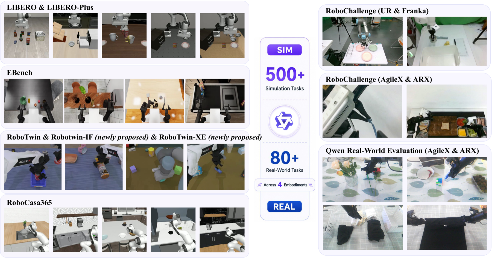
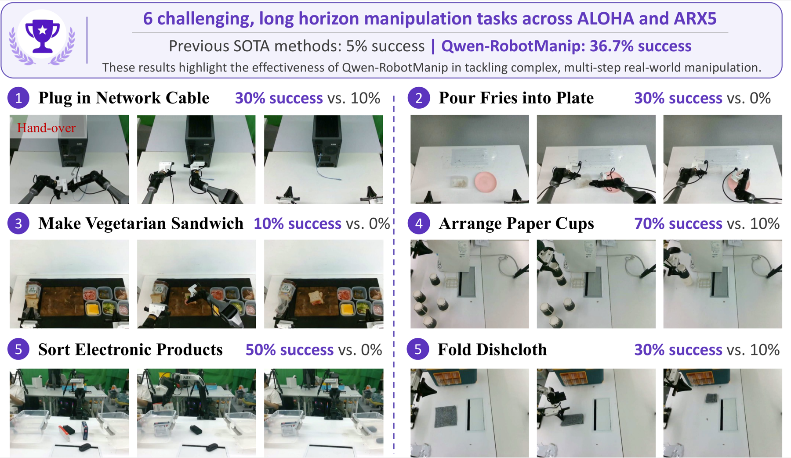
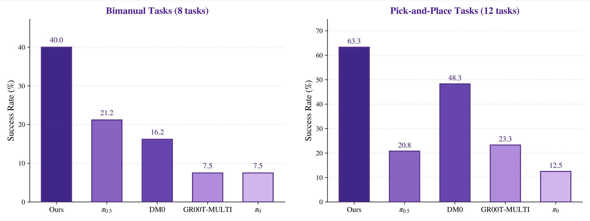

<div align="center">


<h1 style="border: none;">Qwen-RobotManip</h1>

<p><b>Alignment Unlocks Scale for Robotic Manipulation Foundation Models</b></p>

<p align="center">
  <b>Qwen Team</b>
</p>

<p align="center">
    <a href="https://arxiv.org/abs/2606.17846">📑 Technical Report</a> |
    <a href="https://qwen.ai/blog?id=qwen-robotmanip">📖 Blog</a> |
    <a href="https://github.com/user-attachments/assets/40f02223-b9cc-4962-8e33-6d96fd44db51">🖥️ Demo</a>
</p>

</div>

Welcome to the official repository of **Qwen-RobotManip**. Here, you can find official information about Qwen-RobotManip and post your questions ([Issues](https://github.com/QwenLM/Qwen-RobotManip/issues)).

> **Note:** There is currently no plan to release the model weights for Qwen-RobotManip or Qwen-RobotNav. We will continue adding report resources that can be publicly released to this repository.


## 🎬 Demo

**Qwen-Omni × Qwen-RobotManip** — Qwen-Omni observes the scene, randomly proposes manipulation tasks via speech, and judges execution in real time. The two demos below are English-subtitled versions. Qwen-RobotManip completes tasks on the fly with no pre-defined task list, demonstrating open-ended instruction following and generalization.

<table>
  <tr>
    <td width="50%">
      <video src="https://github.com/user-attachments/assets/40f02223-b9cc-4962-8e33-6d96fd44db51" width="100%" preload="metadata" controls playsinline></video>
    </td>
    <td width="50%">
      <video src="https://github.com/user-attachments/assets/2dab71f6-9b75-45e6-b314-6b7e78240a0f" width="100%" preload="metadata" controls playsinline></video>
    </td>
  </tr>
</table>

Qwen-RobotManip is validated across real-robot platforms and tasks, demonstrating generalization to novel scenes, unseen language instructions, and cross-embodiment transfer.

<table>
  <tr>
    <td width="33%">
      <video src="https://github.com/user-attachments/assets/2644976f-eadb-4a6d-958f-0d9c7f794800" width="100%" preload="metadata" controls playsinline></video>
    </td>
    <td width="33%">
      <video src="https://github.com/user-attachments/assets/ca7b7c2a-178c-427c-a5b1-64f174e7f7e4" width="100%" preload="metadata" controls playsinline></video>
    </td>
    <td width="33%">
      <video src="https://github.com/user-attachments/assets/7938f77f-d757-4a13-a6da-70fc602020c5" width="100%" preload="metadata" controls playsinline></video>
    </td>
  </tr>
</table>

If the videos do not render in your browser, open the direct links: [Omni Demo 1](https://github.com/user-attachments/assets/40f02223-b9cc-4962-8e33-6d96fd44db51), [Omni Demo 2](https://github.com/user-attachments/assets/2dab71f6-9b75-45e6-b314-6b7e78240a0f), [Real Robot 1](https://github.com/user-attachments/assets/2644976f-eadb-4a6d-958f-0d9c7f794800), [Real Robot 2](https://github.com/user-attachments/assets/ca7b7c2a-178c-427c-a5b1-64f174e7f7e4), and [Real Robot 3](https://github.com/user-attachments/assets/7938f77f-d757-4a13-a6da-70fc602020c5).


## 💡 Introduction

<div align="center">
  
</div>

<br>

**Qwen-RobotManip** is a generalizable vision-language-action foundation model built upon **Qwen-VL / Qwen3.5-4B**. It couples a vision-language backbone with a **flow-matching Diffusion Transformer action expert**, enabling continuous action generation while preserving the perception and language grounding needed for robotic manipulation.

The central principle is **alignment before scale**. Robot manipulation data is naturally heterogeneous: robot embodiments, action spaces, camera systems, coordinate frames, collection pipelines, and task distributions vary widely. Qwen-RobotManip introduces a unified alignment framework across representation, motion, and behavior so that multi-source training becomes coherent instead of conflicting.

Using only open-source robotic manipulation datasets and egocentric human videos, without proprietary data collection, Qwen-RobotManip constructs a pretraining corpus of approximately **38,100 hours** and demonstrates strong OOD generalization, instruction following, reactive recovery, and cross-embodiment transfer.

### ✨ Key Highlights

- **🔗 Three-Dimensional Alignment.** Representation alignment, camera-frame motion alignment, and behavior alignment make heterogeneous manipulation data trainable under one model.

- **🤖 Unified Cross-Embodiment Action Space.** An **80D canonical state-action representation** with per-dimension binary masks accommodates single-arm, dual-arm, dexterous hand, and mobile manipulation settings.

- **📷 Camera-Frame End-Effector Motion.** End-effector deltas are represented in the camera coordinate frame, with Camera Positional Encoding (CaPE) injecting camera geometry into the action expert.

- **🌍 Open-Source Data at Scale.** The pretraining corpus contains about **38,100 hours** of manipulation data, including **24,808 hours** of human-to-robot synthetic demonstrations across 15 embodiments.

- **🏆 Strong OOD and Real-World Performance.** Qwen-RobotManip leads OOD benchmarks such as LIBERO-Plus, RoboTwin-Clean2Rand, EBench, RoboCasa365, and RoboTwin-IF, and ranks **#1** on the RoboChallenge Table30 v1 generalist track.


## 🧠 Method

<div align="center">
  
</div>

Qwen-RobotManip combines a **Qwen3.5-4B vision-language backbone** with a **flow-matching DiT action expert**. The VLM processes multi-view observations, language instructions, structured embodiment prompts, and execution context. The action expert predicts continuous action chunks through flow matching and uses a small number of Euler integration steps for low-latency control.

The model maps heterogeneous robot states and actions into a shared **80-dimensional canonical vector**. Missing degrees of freedom are zero-padded and excluded from the loss with binary masks, allowing different embodiments to share one template without forcing nonexistent joints or grippers to receive supervision.

For motion alignment, Qwen-RobotManip predicts **camera-frame delta end-effector poses**, making visually similar motions numerically closer across embodiments and coordinate systems. Camera extrinsics and intrinsics are injected through **CaPE**, while end-effector type embeddings and auxiliary flags condition the denoising process.

For behavior alignment, Qwen-RobotManip uses structured embodiment prompts and **in-context policy adaptation**. Recent observation-state-action chunks from the same episode act as an implicit description of the current embodiment and behavior profile, allowing the model to adapt without parameter updates.

<div align="center">
  
</div>

The Human-to-Robot synthesis pipeline converts egocentric hand demonstrations into robot demonstrations through action retargeting, hand removal and inpainting, simulated robot rendering, and depth-guided compositing. This pipeline turns about **1,933 hours** of egocentric human video into about **24,808 hours** of robot-compatible demonstrations across **15 robot embodiments**.


## 🏆 Benchmarks

### In-Distribution Manipulation

Qwen-RobotManip matches or exceeds prior methods on standard in-distribution benchmarks, while the report emphasizes that IID results alone do not reliably measure foundation-model generalization.

| Model | LIBERO SR (%) | RoboTwin Easy SR (%) | RoboTwin Hard SR (%) |
| :--- | :---: | :---: | :---: |
| Qwen-RobotManip | 99.1 | 93.4 | 92.5 |
| **Qwen-RobotManip-Context** | **99.2** | **93.7** | **94.0** |

### Out-of-Distribution Generalization

Qwen-RobotManip is evaluated across task and scene variation, instruction following, and cross-embodiment transfer.

| Benchmark | Metric | Qwen-RobotManip | Qwen-RobotManip-Context |
| :--- | :--- | :---: | :---: |
| LIBERO-Plus | Overall SR (%) | 89.0 | **91.4** |
| RoboTwin-Clean2Rand | Hard SR (%) | 62.6 | **69.4** |
| EBench | Overall SR (%) | **45.6** | 43.6 |
| RoboCasa365 | Total SR (%) | **35.9** | 33.8 |
| RoboTwin-IF | Average SR (%) | **72.2** | 72.0 |

<div align="center">
  
</div>

RoboChallenge Table30 v1 further tests real-world OOD generalization under platform, task, and execution complexity shifts. The generalist track spans **30 tasks across 4 robot platforms**, covering AgileX ALOHA, Franka, UR, and ARX. Qwen-RobotManip ranks **#1** with **45%** success rate and a **59.83** process score, outperforming the third-place system by **20%**.

<div align="center">
  
</div>

- **Bimanual coordination.** On the 8 ALOHA tasks that require tight two-arm coordination, Qwen-RobotManip reaches **40%** average success rate, compared with **21.2%** for $\pi_{0.5}$. It is also the only model to succeed on the "pour fries into plate" task, which requires sequential stabilization, opening, lifting, and pouring.

- **Cross-embodiment pick-and-place.** Across 12 pick-and-place-centric tasks distributed over all four platforms, from single-object grasping to multi-step manipulation involving 4-5 objects, Qwen-RobotManip achieves **63.3%** average success rate, surpassing the next-best baseline DM0 (**48.3%**) by **15.0** percentage points.

<div align="center">
  
</div>

- **Reactive recovery.** In real-robot trials, the policy can retry after slips or failed grasps without an explicitly scripted recovery routine, suggesting that large-scale aligned pretraining helps the model close the loop between visual feedback and corrective action.


## 📜 Citation

If you find our work helpful, feel free to give us a cite.

```bibtex
@misc{qwenrobotmanip2026,
      title={Qwen-RobotManip Technical Report: Alignment Unlocks Scale for Robotic Manipulation Foundation Models},
      author={Qwen Team},
      year={2026},
      eprint={2606.17846},
      archivePrefix={arXiv},
      primaryClass={cs.RO},
      url={https://arxiv.org/abs/2606.17846},
}
```
